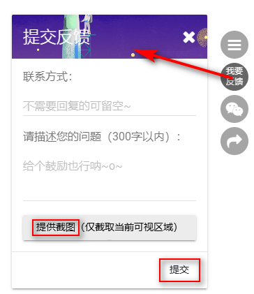
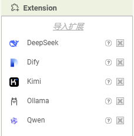
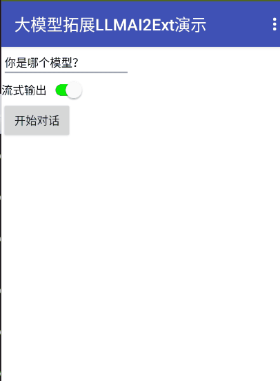
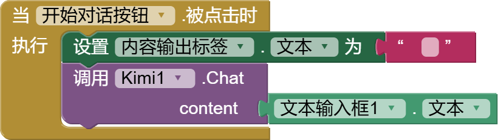
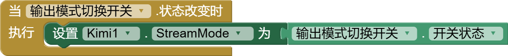
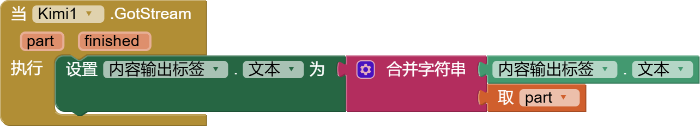
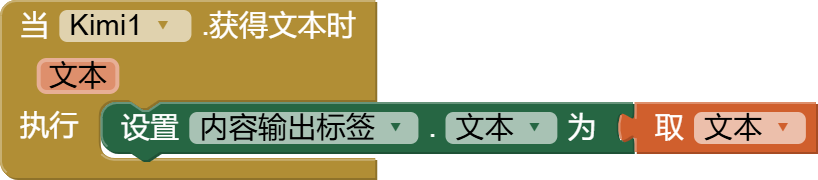
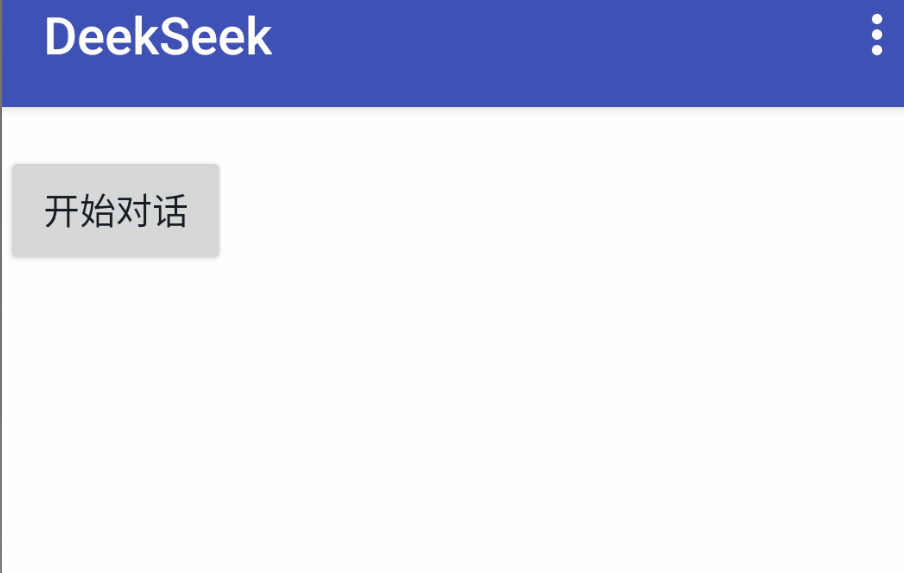
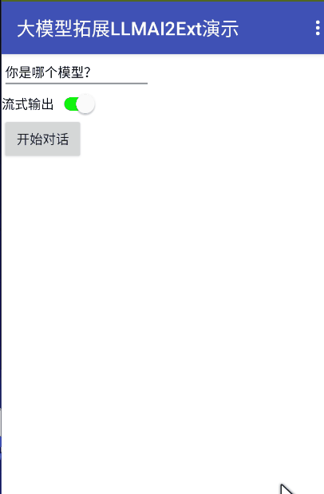

* [ DeepSeek](#DeepSeek)
* [ Kimi](#Kimi)
* [ 阿里通义千问](#Qwen)

## AppInventor2中文网开发国内大模型拓展的初衷

App Inventor 2 原生的ChatGPT组件由于是国外的，使用起来不太便捷，且各种限制。

如今我们又身处AI浪潮之中，包括很多学校在内的国内用户都有AI结合传统的App来开发具有智能App的需求，因此，必须开发拓展以接入国内大模型，对，它专门接国内大模型的，国外的不接。

拓展接口参考了原生ChatGPT组件的简洁设计，在其基础上更加简化，还引入了它不支持的流式输出模式，且**默认输出模式就是流式**的，类似打字机的效果，当然也可以切换非流式，模型回答完成时一把输出。

v1.0 版本现已上线，暂时支持3个大模型的接入（DeepSeek、Kimi、通义千问），**免费开放给全球用户**，当然由于拓展是在最新源码平台上编译出来的，可能有些较老的平台不能很好的运行，有条件的话还是建议使用我们的平台，也会优先获得反馈支持。

当然，好的产品是需要不断迭代的，这款拓展也不例外，欢迎使用并期待您的反馈！

## 拓展下载，免费开放
* .aix 拓展下载：

[cn.fun123.LLMAI2Ext.aix - v1.0](https://www.fun123.cn/reference/extensions/LLMAI2Ext/cn.fun123.LLMAI2Ext.aix)

注：所有大模型拓展共一个.aix拓展文件，里面有多个拓展组件，导入.aix效果参考如下：

回答效果参考如下：

我们尽量将接口方法设计得简单易用，由于demo中包含了APIKey，因此不直接提供aia源码，这里以Kimi为例，附上代码块：

开始对话：

切换输出模式（默认流式输出，可切换非流式一把输出内容）：

流式输出响应事件，每输出一部分内容都会回调一次，追加展示；最后一次回调时 `finished` 参数为`真`：

非流式输出，只回调一次，内容直接展示即可：

##   DeepSeek

使用AppInventor2接入DeepSeek大模型。<a href="https://platform.deepseek.com/api_keys" target="_blank">从深度求索获取 API Key >></a>

由于DeepSeek官方API已停止开放，这里我们可以对接其他厂商部署的DeepSeek服务，比如百度、阿里都有部署，百度服务用起来过于复杂，这里选择阿里的DeepSeek服务进行测试验证：

`BaseURL` 由官方的改为：`https://dashscope.aliyuncs.com/compatible-mode/v1`

`APIKey` 用阿里云的。

`ModelName` 指定：deepseek-v3 或 deepseek-r1

参考测试结果如下：

### 属性

{:id="DeepSeek.APIKey" .text} *APIKey*
: 模型的Api Key。

{:id="DeepSeek.BaseURL" .text} *BaseURL*
: DeepSeek 基础 URL，默认是官方地址，但由于官方API暂未开放充值，可考虑使用第三方DeepSeek服务地址。

{:id="DeepSeek.ModelName" .text} *ModelName*
: 模型名称。

{:id="DeepSeek.StreamMode" .boolean} *StreamMode*
: 流式输出模式是否开启，默认'真'。
流式输出，即生成内容时边计算边返回，减少等待时间，提高响应速度，适用于聊天、代码补全等场景。
不开启，则是最终仅一次返回全部内容。

### 事件

{:id="DeepSeek.GotStream"} GotStream(*part*{:.text},*finished*{:.boolean})
: 流式输出，每当有内容返回时都会触发该事件。part 为当前增量的部分内容，finished 标识输出是否已结束。

{:id="DeepSeek.GotText"} GotText(*text*{:.text})
: 非流式输出完成时触发该事件。text 为完整输出内容。

### 方法

{:id="DeepSeek.Chat" class="method"} <i/> Chat(*content*{:.text})
: 开始与 DeepSeek 大模型进行对话。

##   Kimi

使用AppInventor2接入Kimi大模型。<a href="https://platform.moonshot.cn/console/api-keys" target="_blank">从 Moonshot 获取 API Key >></a>

### 属性

{:id="Kimi.APIKey" .text} *APIKey*
: 模型的Api Key。

{:id="Kimi.ModelName" .text} *ModelName*
: 模型名称。

{:id="Kimi.StreamMode" .boolean} *StreamMode*
: 流式输出模式是否开启，默认'真'。
流式输出，即生成内容时边计算边返回，减少等待时间，提高响应速度，适用于聊天、代码补全等场景。
不开启，则是最终仅一次返回全部内容。

### 事件

{:id="Kimi.GotStream"} GotStream(*part*{:.text},*finished*{:.boolean})
: 流式输出，每当有内容返回时都会触发该事件。part 为当前增量的部分内容，finished 标识输出是否已结束。

{:id="Kimi.GotText"} GotText(*text*{:.text})
: 非流式输出完成时触发该事件。text 为完整输出内容。

### 方法

{:id="Kimi.Chat" class="method"} <i/> Chat(*content*{:.text})
: 开始与 Kimi 大模型进行对话。

##  阿里通义千问

使用AppInventor2接入阿里通义千问大模型。<a href="https://dashscope.console.aliyun.com/api-key_management" target="_blank">从阿里云获取 API Key >></a>

### 属性

{:id="Qwen.APIKey" .text} *APIKey*
: 模型的Api Key。

{:id="Qwen.ModelName" .text} *ModelName*
: 模型名称。

{:id="Qwen.StreamMode" .boolean} *StreamMode*
: 流式输出模式是否开启，默认'真'。
流式输出，即生成内容时边计算边返回，减少等待时间，提高响应速度，适用于聊天、代码补全等场景。
不开启，则是最终仅一次返回全部内容。

### 事件

{:id="Qwen.GotStream"} GotStream(*part*{:.text},*finished*{:.boolean})
: 流式输出，每当有内容返回时都会触发该事件。part 为当前增量的部分内容，finished 标识输出是否已结束。

{:id="Qwen.GotText"} GotText(*text*{:.text})
: 非流式输出完成时触发该事件。text 为完整输出内容。

### 方法

{:id="Qwen.Chat" class="method"} <i/> Chat(*content*{:.text})
: 开始与千问大模型进行对话。
